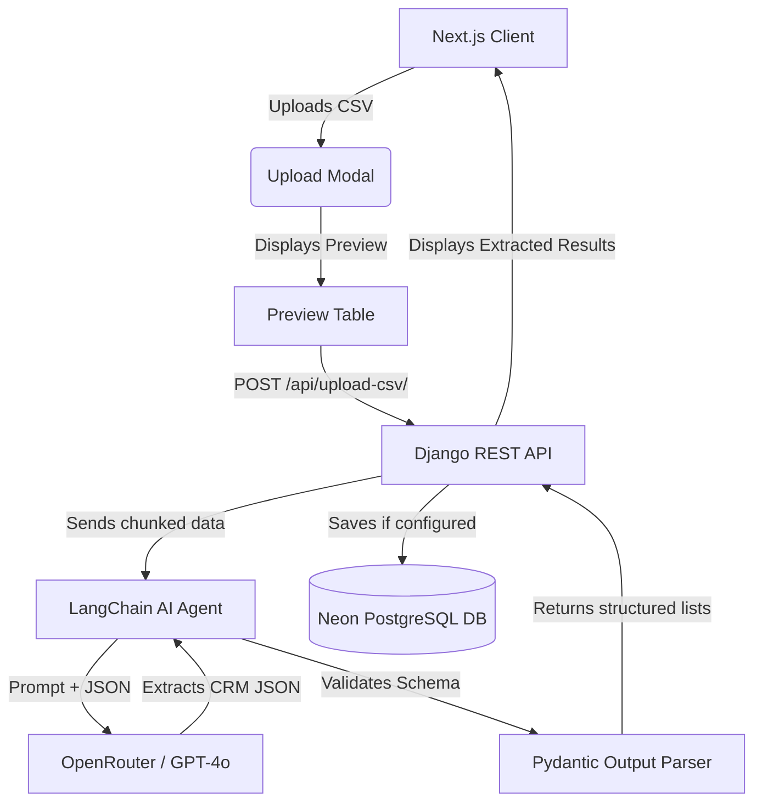
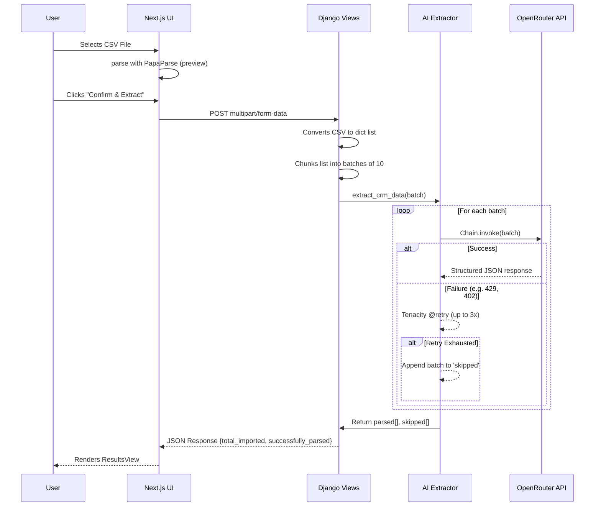

# GrowEasy AI CSV Importer

An AI-powered CSV Importer that extracts CRM lead information from any valid CSV format.

## Architecture
- **Frontend**: Next.js, Tailwind CSS, Lucide React
- **Backend**: Django, Django REST Framework, LangChain, Pydantic, Tenacity (Retries)
- **AI Model**: GPT-4o via OpenRouter

## Features Implemented
- [x] Drag & Drop CSV Upload (via standard inputs, can be enhanced with dropzone)
- [x] Resilient AI Parsing with auto-retries for failed LangChain batches
- [x] Modern UI matching Figma/Reference designs
- [x] Deployment configurations for Vercel & Render
- [x] Docker & Docker Compose setup for local development

## Setup Instructions

### Local Development (Docker - Recommended)

1. Ensure you have Docker and Docker Compose installed.
2. In the root directory, create `.env` in the `backend/` folder:
   ```
   OPENROUTER_API_KEY=your_key_here
   ```
3. Run the following command:
   ```bash
   docker-compose up --build
   ```
4. Access the frontend at `http://localhost:5173`

### Local Development (Manual)

#### Backend
```bash
cd backend
python -m venv venv
.\venv\Scripts\Activate.ps1
pip install -r requirements.txt
python manage.py runserver
```

#### Frontend
```bash
cd frontend
npm install
npm run dev
```

## Bonus Points Completed
- **Retry Mechanism**: The backend uses `tenacity` to retry failed API calls to the LLM up to 3 times before skipping the batch.
- **Docker Setup**: Unified `docker-compose.yml` and individual Dockerfiles provided.
- **Deployment Ready**: Included `vercel.json` and `render.yaml` configurations.

## Architecture Diagrams

### High Level Design (HLD)


### Low Level Design (LLD) - AI Extraction Flow

